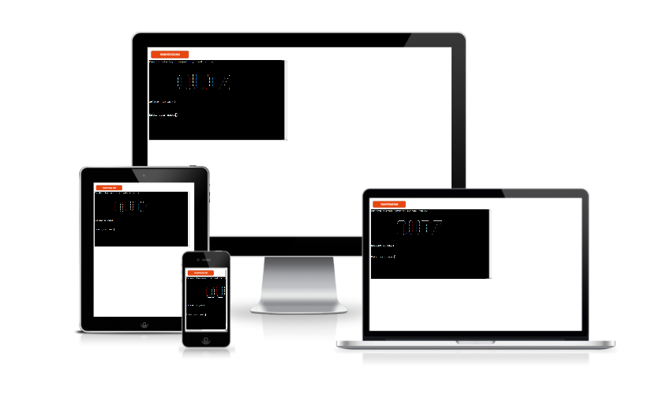
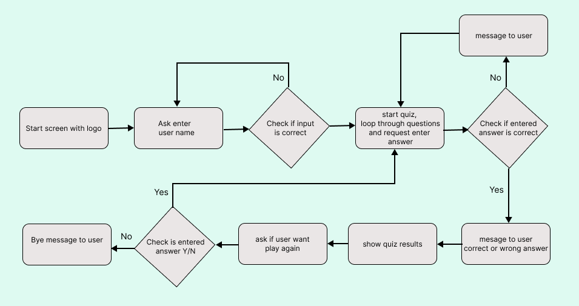
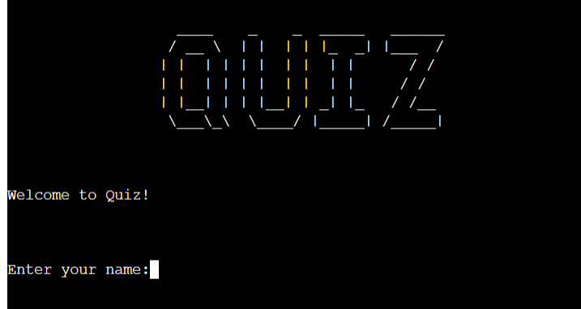
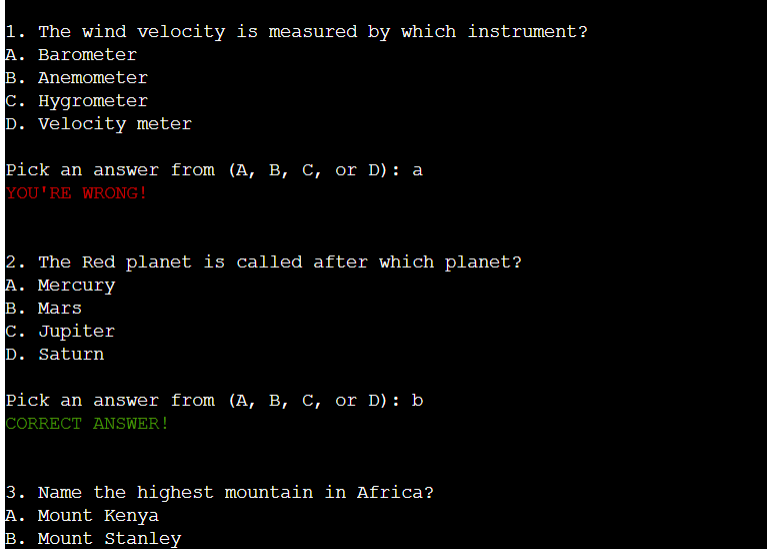
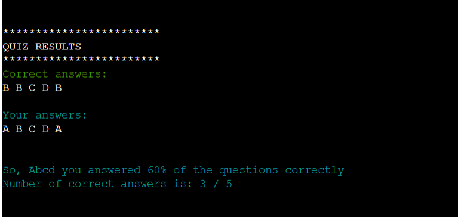
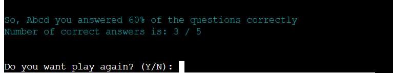
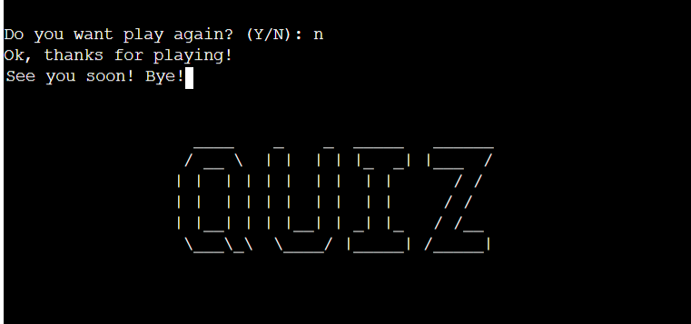

# QUIZ

This quiz is a simple game played on the command line. This is a quiz with multiple choice general knowledge questions.
Users can try to guess the answer by inputting letter as an answer.

You can view the live site here - [QUIZZ](https://quizz-quest.herokuapp.com/).

## Contents

+ [User Experience](#user-experience)
  + [User Stories](#user-stories)
  + [Flowchart](#flowchart)
  + [Design](#design)
+ [Features](#features)
  + [Start](#start)
  + [Playing The Game](#playing-the-game)
  + [Quiz Results](#quiz-results)
  + [End of Game](#end-of-game)
+ [Tecnologies Used](#technologies-used)
- [Testing](#testing)
- [Bugs](#bugs)
+ [Deployment](#deployment)
+ [Credits](#credits)
+ [Acknowledgements](#acknowledgements)

## User Experience

### User Stories

+ As a user I want to understand how the game works.
+ As a user I want to have fun and test my knowledge.
+ As a user I want to know the result of the game.
+ As a user I want to be able to restart the game.

[Back to top](#contents)

### How to play

The quiz is made similar to those that can often be found on the Internet.
The quiz is made by analogy with those that can often be found on the Internet.
Game logic should be intuitive to the user.

+ The program presents one by one general knowledges questions and multiple answers below question

+ The player then chooses and input letter that he/she thinks will be appropriate for an answer

+ After cycling through all questions the program presents results of game displaying correct answers and user answers in appropriate named rows

+ Then the game offers to player play again and otherwise return to the start screen.

[Back to top](#contents)

### Flowchart

As this game is played in the console, I did a simple flowchart to get a map for that how I wanted it to work.

### Design

As the quiz takes place through the terminal, I've highlighted the messages in color for the user to better understand the progress of the game and the results of the quiz.

[Back to top](#contents)

## Features

### Start

When the quiz starts, the user sees a start screen with a logo and prompts for entering a name

### Playing the quiz

+ When playing the quiz user receive message in green when the guess is correct.
+ If user guess is wrong then he/she receive message in red color

### Quiz Results

When the quiz is finished the quiz results will be presented to the user so that he can compare the correct answers and his own answers. The result of the quiz will also be shown in percentage and quantitative terms.

### End of quiz

+ User can choose if he/she wants to play again or return to main screen.

+ If user choose quit quiz the thanks message displayed for user and quiz returns start screen.

[Back to top](#contents)

## Technologies Used

+ [Figma](https://www.figma.com/) was used to create the flowchart
+ [Gitpod](https://www.gitpod.io/) was used to create all files with code
+ [Python](https://www.python.org/)
+ [GitHub](https://github.com/) was used for storing the code repository
+ [Heroku](https://heroku.com/) was used to deploy the program live version
+ [Am I Responsive](http://ami.responsivedesign.is/) to generate an image showcasing the game responsivness to different screen sizes
+ Termcolor module is used for color formatting for output in the terminal

[Back to top](#contents)

## Testing

### Manual testing

This project has been tested manually for the most part. Mostly by myself playing it over and over again to make sure the logic worked. Manual testing was also done for making sure I got necessary feedback while playing, and that the feedback was presented in a clear way.

### Validator testing

Code validation done with [PEP8 online](http://pep8online.com/).

[Back to top](#contents)

## Bugs

### Fixed bugs

+ During tests I found that at the start of a quiz input takes a white spaces as a user name. A built-in Python isalnum() function is used to validate user input that checks whether all characters in a string are alphanumeric.|

+ When the user plays again, the list of user's answers is added to the answers of the previous quiz. Resolved by clearing the list of answers before starting a new quiz using the clear() method.

[Back to top](#contents)

## Deployment

### To deploy the project

This project is deployed using [Heroku](https://heroku.com/) and linked to GitHub.

Steps to deploy are as follows:

1. Login into Heroku
2. Create a new app. Click on "New" and then choose "New App".
3. Navigate to "Settings". In "Settings" select "BuildPack" and select Python and Node.js. (Python must be at the top of the list).
   While in "Settings", click "Reveal Config Vars" and input the folloing. KEY: PORT, VALUE: 8000.
4. Navigate to the "Deploy" menu. Connect the app to GitHub using the GitHub connection option.
   Search for the repository in GitHub. Click "Connect" on selected repository.
5. Choose "Enable Automatic Deploys" or "Deploy Branch" in the manual deploy section.
6. Heroku will now deploy the app, And you can open the app.

[Back to top](#contents)

## Credits

- [Bro Code YouTube tutorial](https://youtu.be/yriw5Zh406s) and [Mike Dane YouTube tutorial](https://youtu.be/SgQhwtIoQ7o) were helpful for inspiration when setting up the basic structure of the quiz.
- StackOverFlow- [help with colored output with Python](https://stackoverflow.com/questions/39473297/how-do-i-print-colored-output-with-python-3)
- [ASCII Art Generator](https://www.developmenttools.com/ascii-art-generator/) - for logo for quiz start screen.
- [W3schools.com](https://www.w3schools.com/python/default.asp)
- [Real Python](https://realpython.com/)

[Back to top](#contents)

## Acknowledgements

This quiz was made as the Porfolio Project 3 for the Diploma in Software Development (E-commerce Applications) education at [Code Institute](https://codeinstitute.net/). 

Many thanks to my mentor Martina Terlevich for supporting me in the project and prompt answers to my questions.
Also I would like to thank the community at Code Institutes Slack channels.
